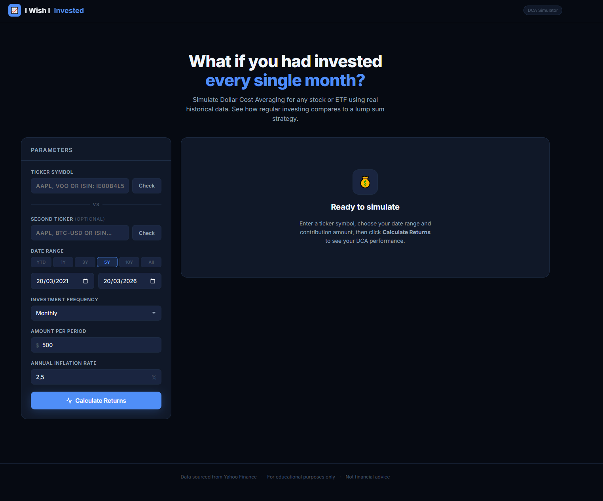

# I Wish I Invested

> **"What if I had invested $500/month in Apple since 2010?"**

A free, no-login dollar-cost averaging (DCA) calculator that shows you the real historical returns of any stock, ETF, or cryptocurrency.

[](https://iwishiinvested.vercel.app/)
[](https://www.buymeacoffee.com/victorpiella)



---

## Features

- Search any ticker — stocks, ETFs, crypto
- Set a monthly investment amount and date range
- See total invested vs. final value, profit, and CAGR
- Interactive chart with DCA breakdown
- Powered by Yahoo Finance data — no API key needed

## Running Locally

You need two terminals:

**1. Start the proxy server**

```bash
node server.js
```

**2. Open `index.html`** with VS Code Live Server or any static file server.

The proxy runs on `http://localhost:3001` and handles CORS for Yahoo Finance and OpenFIGI.

## Stack

- Vanilla HTML / CSS / JS — zero frameworks, zero build step
- [Chart.js](https://www.chartjs.org/) for the chart
- Node.js proxy to bypass CORS on external APIs

## Deploying

Hosted on Vercel. The static frontend is served directly; the proxy (`server.js`) runs as a serverless function.

## Disclaimer

Data sourced from Yahoo Finance. For educational purposes only. Not financial advice.

---

If this saved you some time or sparked an idea, consider buying me a coffee ☕

[](https://www.buymeacoffee.com/victorpiella)
